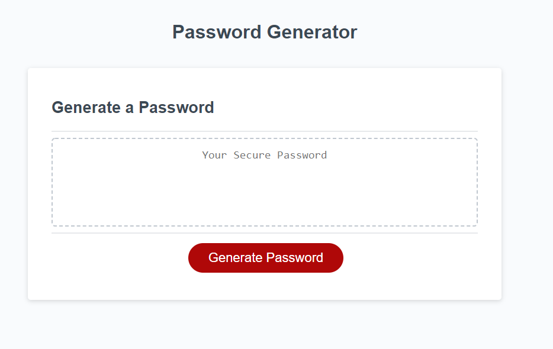
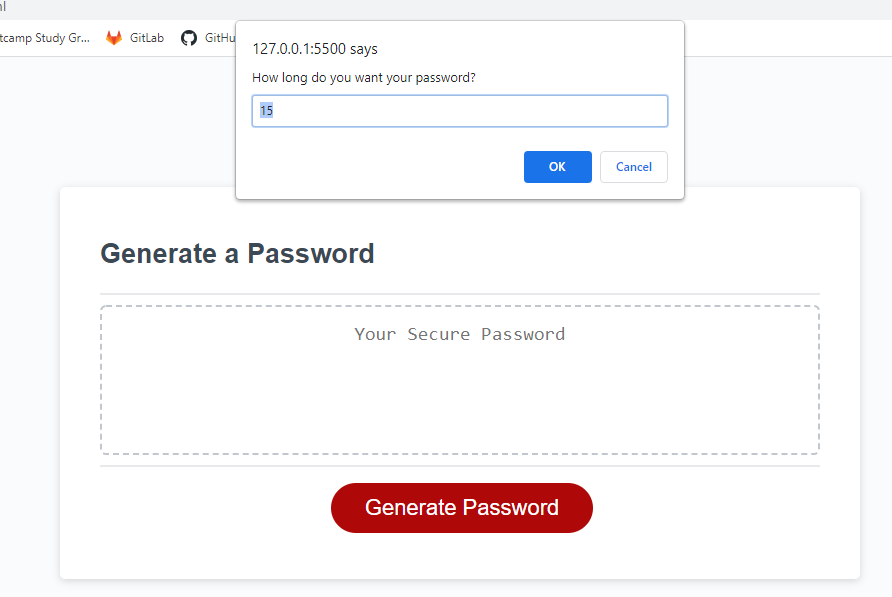
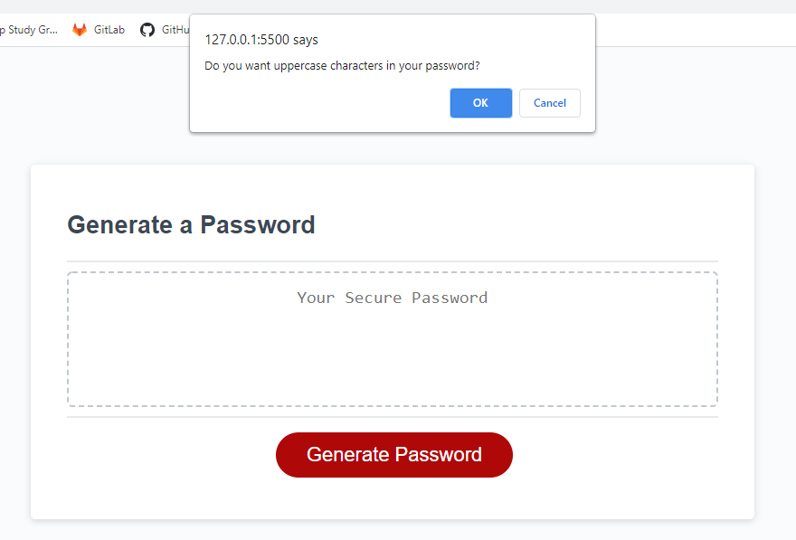
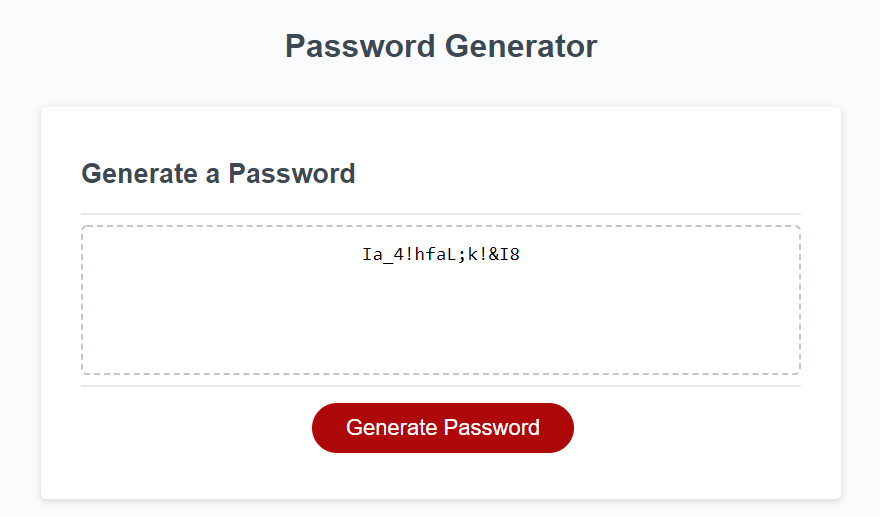

# Random Password Generator

## Description
An application that enables employees to generate random passwords based on criteria that they’ve selected. This app will run in the browser and will feature dynamically updated HTML and CSS powered by JavaScript. It has a clean and polished, responsive user interface that adapts to multiple screen sizes. As a class homework assignment, I was provided a functional HTML & CSS file along with a partially complete JS file.

[Deployed Application](https://spreston4.github.io/password-generator/)

[GitHub Repo](https://github.com/spreston4/password-generator)

## How to
When the application is loaded, the user is presented with the following screen. Press the red 'Generate Password' button to begin!


The user will be promted to enter a length for their password. Enter a valid number (between 8 and 128) to begin. The input is validated to ensure value less than 8 or greater than 128 trigger a prompt to the user to input a valid password length.


The user will then be prompted to select which type of characters they want included in their password. They can choose to include uppercase characters, lowercase characters, special characters, and numbers. At least one type of character must be selected to generate the password. Selecting 'OK' will include that type of character in the password while selecting 'Cancel' will exclude that type of character from the password.


Once a valid password length has been given, and the character types selected, the applicaton generates a random passord based on the previous inputs. The password is displayed to the main screen. The password can be copied directly from the display box.



## Technologies Used
Built in Visual Studio with:
* HTML
* CSS
* JavaScript

## User Story
Given the following User Story:
```
AS AN employee with access to sensitive data
I WANT to randomly generate a password that meets certain criteria
SO THAT I can create a strong password that provides greater security
```

## Acceptance Criteria
Given the following Acceptance Criteria:
```
GIVEN I need a new, secure password
WHEN I click the button to generate a password
THEN I am presented with a series of prompts for password criteria
WHEN prompted for password criteria
THEN I select which criteria to include in the password
WHEN prompted for the length of the password
THEN I choose a length of at least 8 characters and no more than 128 characters
WHEN prompted for character types to include in the password
THEN I choose lowercase, uppercase, numeric, and/or special characters
WHEN I answer each prompt
THEN my input should be validated and at least one character type should be selected
WHEN all prompts are answered
THEN a password is generated that matches the selected criteria
WHEN the password is generated
THEN the password is either displayed in an alert or written to the page
```

## Contact Me
GitHub: [spreston4](https://github.com/spreston4)

E-mail: [sam.preston11@gmail.com](mailto:sam.preston11@gmail.com)